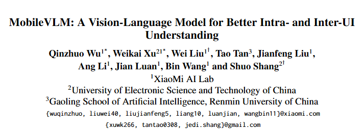
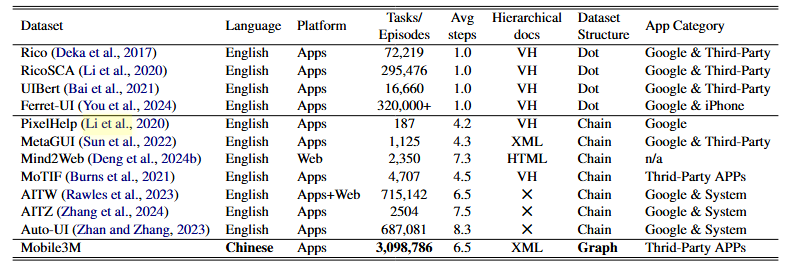
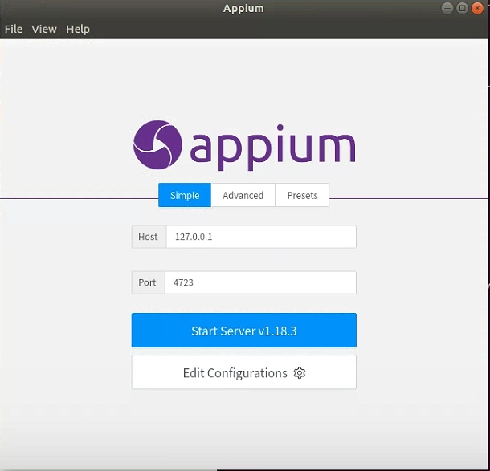
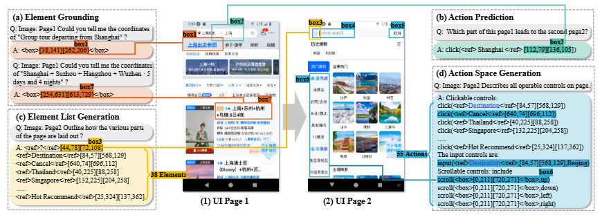

# MobileVLM


## Paper Link
[MobileVLM: A Vision-Language Model for Better Intra- and Inter-UI Understanding](https://aclanthology.org/2024.findings-emnlp.599/)

### News
- **2024.11.12** - Partial training data and random walk code for Mobile3M released!
- **2024.10.4** - Test data for Mobile3M released!
- **2024.9.26** - Our work accepted by EMNLP 2024 Findings!

### 1. Quick Start

#### Requirements
- transformers==4.32.0
- accelerate
- tiktoken
- einops
- transformers_stream_generator==0.0.4
- scipy
- torchvision
- pillow
- tensorboard
- matplotlib

### 2. Mobile3M Dataset
  <!-- Replace with actual image path -->

#### Training Data
Training data is available at the following link: [data](https://huggingface.co/datasets/xwk123/Mobile3M/tree/main). We will gradually upload data for all apps.


#### Training Json
Training json files are available at the following link: [training_jsons](https://huggingface.co/datasets/wuqinzhuo/MobileVLM_traindata/tree/main). 

#### Corpus Collection Script
To start collecting data, run the script `main/corpus/googleCreatDataset/arm_graph_para_lock.py`.

Example usage:
```bash
python googleCreatDataset/arm_graph_para_lock.py --device_name 10.53.89.79:6532 --systemPort 8112 --appid 8201 --command_executorhttp://127.0.0.1:4812/wd/hub--appPackage com.lucky.luckyclient --name_en lucky --diff_max 0.5 --diff_png 0.3 --waitadb 8 --prefix lucky0_3_1_2_ --recheck -1
```

Running the above collection instruction requires the following additional installations.

- Install Node.js and Appium:

    ```bash
    curl -fsSL https://deb.nodesource.com/setup_20.x | sudo -E bash -
    sudo apt-get install -y nodejs
    sudo apt install npm
    npm install -g appium@1.18.3
    ```
- Install graphical libraries:  
   `sudo apt-get install xorg`

- Activate the Python virtual environment:  
   `source /path/to/new/virtual/environment/bin/activate`

- Install Appium Python Client 1.3.0:  
   `pip install Appium-Python-Client==1.3.0`


#### Parameter Descriptions

- **device_name**: Name of the emulator.
- **appid**: Storage ID of the app being collected, e.g., 8201.
- **command_executor**: Appium system endpoint URL.
- **--diff_max 0.5 --diff_png 0.3**: Page similarity thresholds for differentiating screens.
- **--prefix lucky0_3_1_2_**: Distributed starting path for data collection.
- **--recheck -1**: Specifies whether to recheck previously collected data. Set to `-1` for no recheck.


### Appium



---


### Data Generation Code for Each Task
  <!-- Replace with actual image path -->

The code for generating data for each task can be found in the following directories:

### Our Test Data
Our test data is available at [data](https://huggingface.co/datasets/xwk123/mobilevlm_test).

### 4. License

The dataset of this project is licensed under the [**Creative Commons Attribution-NonCommercial-ShareAlike 4.0 International (CC BY-NC-SA 4.0)**](https://creativecommons.org/licenses/by-nc-sa/4.0/) license.

The source code of the this is licensed under the [**Apache 2.0**](http://www.apache.org/licenses/LICENSE-2.0)  license.


#### Summary of Terms
- **Attribution**: You must give appropriate credit, provide a link to the license, and indicate if changes were made.
- **NonCommercial**: You may not use the material for commercial purposes.
- **ShareAlike**: If you remix, transform, or build upon the material, you must distribute your contributions under the same license as the original.

#### License Badge
[](https://creativecommons.org/licenses/by-nc-sa/4.0/)

### 5. Citation
If you'd like to use our benchmark or cite this paper, please kindly use the reference below:

```bibtex
@article{wu2024mobilevlm,
  title={Mobilevlm: A vision-language model for better intra-and inter-ui understanding},
  author={Wu, Qinzhuo and Xu, Weikai and Liu, Wei and Tan, Tao and Liu, Jianfeng and Li, Ang and Luan, Jian and Wang, Bin and Shang, Shuo},
  journal={arXiv preprint arXiv:2409.14818},
  year={2024}
}
